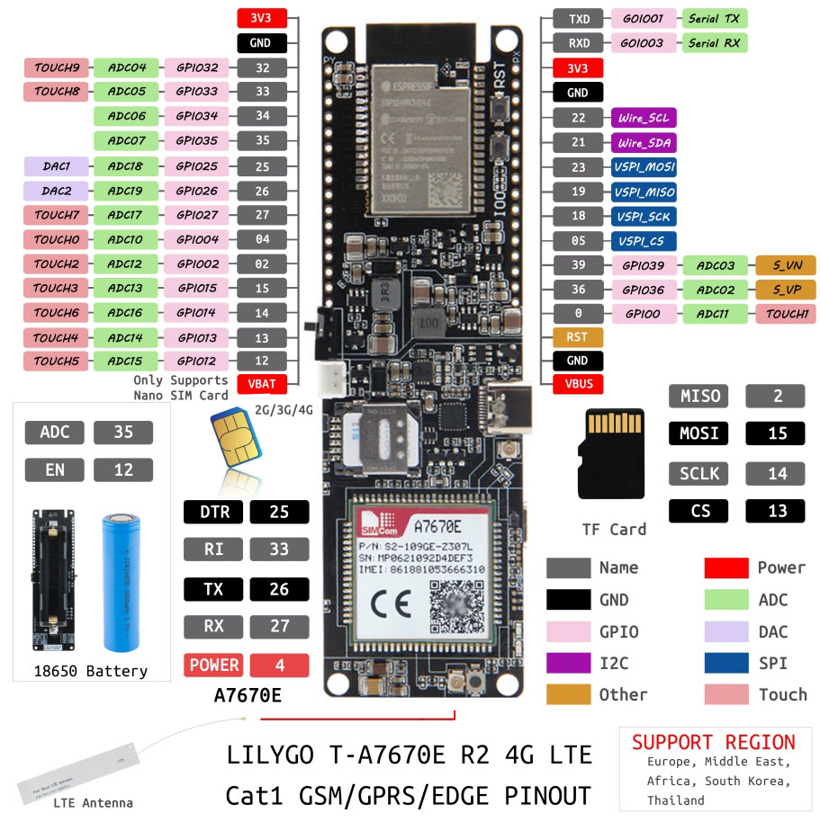

# Traccar GPS Tracker using Lilygo A7670E

This the code I use for the GPS tracker on my bike. I send commands using SMS and it posts the GPS data to a Traccar server using the [OsmAnd protocol](https://www.traccar.org/osmand/) (the one from the android app).

The actual code is inside the [ebike-gps directory](./ebike-gps). To use this, you need to configure some stuff by creating a `ebike-conf-priv.h` in the same directory. The contents of this file have the following format:

```cpp
#pragma once

// Replace with your phone number (to send SMS commands)
#define MY_PHONE "+ZZXXXXXX"
// URL of the traccar server
#define TRACCAR_URL "https://traccar.org"
// ID of the device in the traccar server
#define TRACCAR_ID "123"
// It depends on the operator whether to set up an APN (optional)
#define NETWORK_APN "internet"
// SIM might need PIN to unlock (optional)
#define SIMCARD_PIN "1234"
```

There's also behavior that can be configured by changing the values in the [ebike-conf.h file](./ebike-gps/ebike-conf.h).


## How it works

On boot, the modem connects to the network and enables GPS. In this state it just keeps the GPS connection alive and sleeps while waiting for commands. You have the following commands available via SMS:

- RESTART - Restarts the device.
- GPS - Returns the current location as a google maps link.
- BAT - Current battery level. Due to a quirk in the board, if charging through USB, this value will be 0.
- TRACK - Starts reporting current location to the configured traccar server.
- TRACKOFF - Disables location posting to the traccar server.
- ALARM - Alerts you the next time the tracker moves. This is pretty sensitive, so it works well as tamper detection. Note that the alarm disables itself after each trigger to reduce spam.
- ALARMOFF - Disables the alarm. To be honest, touching the vehicle is enough to trigger the alarm and disable it.

BTW, the accelerometer is a LSM6DS3 breakout board, which is connected to the Lilygo A7670E via I2C.

If the tracker doesn't detect movement for 2 minutes, it enables the "alarm". If it goes 12 hours without movement, it turns off the modem and enters deep sleep. You can configure this values in the `ebike-conf.h` file.

## Compilation

Just check the original readme by Lilygo [here](./README.orig.md).

## TODO

- ~~An off state where everything is in deep sleep and only wakes up on SMS commands. This would save a lot of battery, but I haven't figured out how to do it yet~~.
- Saving the location to the SD card when posting fails. This allows you to send it when the connection is restored.

To be honest, I don't really recommend this board for a GPS tracker, as it has some quirks that make it less than ideal. For example, the battery level is not reported correctly when charging via USB.

## Official info




